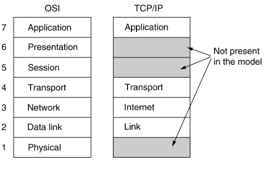
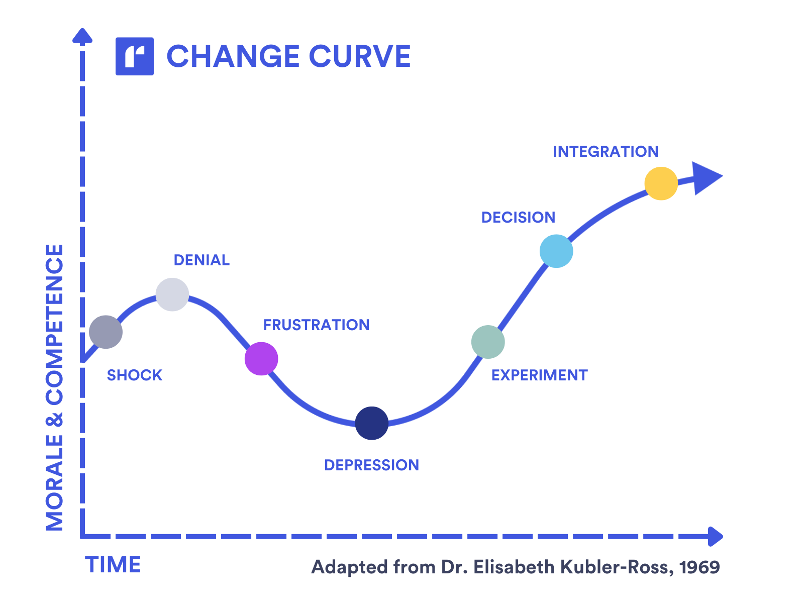
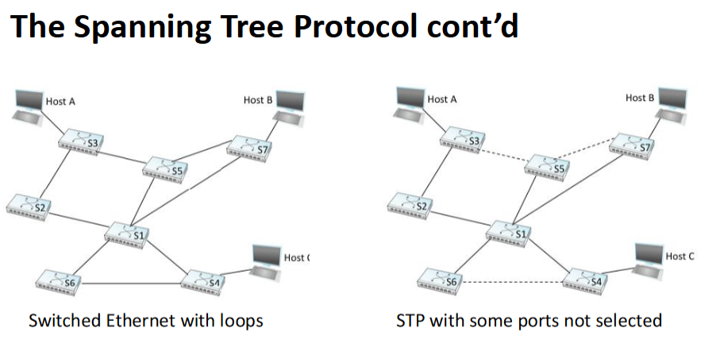
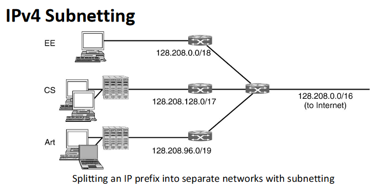
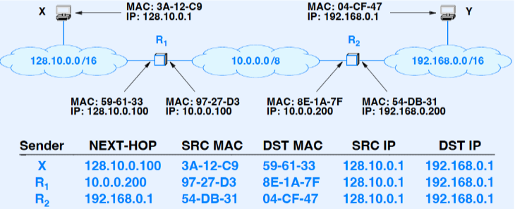
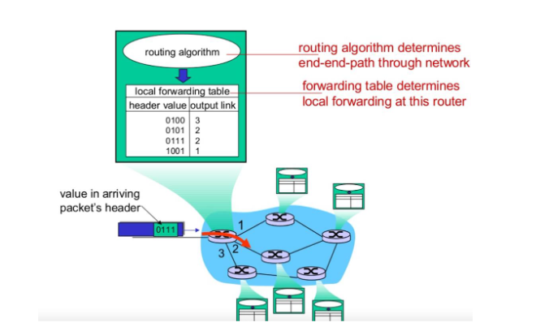

## Computer Networks the Fundamentals

## What is Data Networking?

Its shuffling data from one computer to another.
A system of hardware, software, and protocols used to move data from one device to another.
Started because of resource sharing, we need to share information with eachother, also resources like hardware.
Just like humans the computers and data centers need to communicate with eachother. Much more efficient to make paths for the data instead of deliviring tapes or drives and alike. Right now computer networks is used for humans to communicate but seems to be more and more computers communicating with eachother. Mobile networks are starting to become a part of what we call internet, we expect to be able to surf the web when we connect to a cell tower or a wifi on the go.

When we talk about CN people seem to recall the layering concept.

## Protocol Layering and Encapsulation

| Layer 5               |                       | Layer 5               |
| ----------------------- | ----------------------- | ----------------------- |
| Layer 4               |                       | Layer 4               |
| Layer 3               |                       | Layer 3               |
| Layer 2               |                       | Layer 2               |
| Layer 1               |                       | Layer 1               |
| Physical- Medium | Physical- medium | Physical- medium |

The layer have interfaces between each layer
theres a layer between 3 and 4, the same is true for 4 and 5....
The layers cannot access everything of the top and bottom layer, its an api in a sense.
The data sent through the layers have no idea what theyre sending other than the data of where and how to get it to the other layer.
You send the message with a new header and/or tail to intruct the next layer of what to do, the payload itself is untouched until it arrives.

## Protocol Reference Models

The OSI model is often used as a principel in text books but the networks that should use this model instead of the tcp/ip one often fail to do so.
OSI distinguishes how different nodes in the network talks to eachother and with what protocol, "host-router protocol"
Very well defined separation between the layer in between the layers, the tcp model can easily muddy up the difference between the implementation

OSI failed with having a bit too many layers
The session layer was introduced to decide who talks first and in what order ex. token exchange.
Presentation layer was supposed to introduced different formats to use in the packet.

Application layer is the application specific protocols, ex http for webbrowsers or SMTP. POP for email.

TCP/IP
Designed the other way to the OSI, OSI designed from ground up where TCP/IP started out with people hacking together things needed for the layer.
After some time it was decided physical layer was not to be part of the TCP/IP model but mostly for necessity cause IEEE handles physical products which the group designing TCP/IP does not.
TCP decided to let application layer handle these session and presentation layers to "simplifiy".
This stack is very generic and immesnly easier to develop around compared to the OSI model.

Mentions "The Elephant model" acceptance, doesnt seem to be the real name need to see later.

## Layer 1 - The Physical Layer

No protocols at this layer but cabling and network cards must adhere to sets of standards and criteria ex.

* Voltages
* Speeds
* Wiring

## Layer 2 - The (Data) Link Layer

First layer we see something resembling protocol

the logical link layer that takes care of the framing part, how do i send from one adress to another.

[A] ---- [B]
Two connected nodes in the datalink layer with "nothing" in between.
Could be physical repeaters or hubs and alike so we need adressing like MAC adress to handle who and where its going to and from.

* Responsibilites
  * Framing
    * The physical layer there isnt a concept of a packet, its not until you get to data link layer you get something resembling that which is called framing.
  * Error COntrol
  * Flow Control
    * if two super computers talk to eachother but theres a normal pc inbetween its the bottle neck this is congestion and not flow control
    * **FEC** Forward Error Correction, you can repair the message if some packages are lost on the way
    * **ARQ** Automatic Repeat Request, if something goes wrong you timeout and ask for the data to be sent again.
  * Adressing

Media Access Conrol (MAC)
Not always needed if you example have two ways for the data to flow, like a road. MAC is used to handle when things get sent and without collisions
**CSMA/CD** handles collisions, waits for enough time of silence before sending

## MAC Adresses

* Identifies a device on a local network
* a 48-Bit hexadecimal number
* Also called physical or burnt-in adresses
  * This is provided by the hardware manufacturer of example the network card.

Many times today we dont need this coliision control devices.

* Classic Ethernet
* Switched Ethernet
  * Learns what port a node is on unlike hubs
    * First message is broadcasted like a hub but then builds a table when the packets arrive to the recipient "learning switch"

## Switching Basics

Here we are forwarding things only using their physical adresses (MAC) and they dont know what the concept of IP adresses are.

* Allows us to interconnect links
* A Multi-Input/output, device
* Can connect switches to each other and hosts
* Each port is a separate *collision domain*

## The spanning tree protocol

Without this a ARP request can be looped forever when it tries to find the nodes of the network
This protocol makes a tree without any cycles to prevent these loops

* Prevents a packet from cirulating switches
* How the Spanning Tree Protocol or STP works
  * Executed at startup
  * Distributed algorithm
    * Each switch runs STP independently
    * No central coordination
  * Guaranteed to converge quickly
  * No data packets will be forwarded until STP finishes

## Virtual LANs

(B.A) (B.B) two organistaions
they should not be connected in a way so they can see eachothers traffic. They can assign ports to different organisations to seperate them. By doing so it will only broadcast on the one like in their assigned port instead of everyone in the network

* Switches do not scale
* VLANs make switches scale
* VLANs split a LAN into several seperate "Virtual" LANs

## The IEE 802.1Q Standard

| 802.3  | Destinaton  Address |                  |                                       | Source Adress | Length | Data | Pad | Checksum |
| -------- | :------------------------- | ------------------ | --------------------------------------- | --------------- | -------- | ------ | ----- | ---------- |
| 802.1Q |                          | VLAN protocol ID | Tag                                   |               |        |      |     |          |
|        |                          |                  | TAG INFO Pri CFI VLAN Identifier |               |        |      |     |          |

## Internet Architecture and Design

* Key principles
  * Designed for the current service it provide and services we see moving forward

    * able to accommodate iptv, streaming and alot more through time because we can build new services ontop of internet. If internet was specified stricly it would be much harder to implement all these things
* Infrastructures
  * Provides a packet communication service, cannot promise it arrives its the transport layers problem
  * Treats all attached enpoints as equal
  * Does not restrict or dictate packet contents not underlying network technologies
* Attached endpoints

## Advantages of the Internet Philosophy

* Accommodates heterogenous underlying networks
* Accommodates arbitrary application and services
* Seperates communication from services

We do not have problems like "dang we inventer fiber optics we need to redesign the whole internet". Its just a piece in a puzzle.
It does not specify too much

## Internet

* A network of networks approach
* Allows arbitrary networks to be included
  * if you can communicate with IP you can do what ever you want and communicate with the other networks
* Uses IP routers to interconnect individual networks
* Permits each router to connect two or more networks

slide immages page 19 insert here

## Adressing in the Internet

* This is the reason we cant use MAC on the internet

  * it restrict who and what can use the internet,
* Solution

  * Creat a new adressing scheme that is independent of MAC adresses
  * Two possibilites:
    * Identity
      * very hard to have everyone a identifier, need big registry of all users
    * Locator
      * if i use the network at university here i get a adress that tells everyone im in karlstad it helps with routing

## Two types of IP Addressing Schemes

IPv4 most used in the world and especially western countries

* IPv4
  * 32-bit binary value
  * Divided into two parts
    * Prefix: network
    * Suffix: host
* IPv6
  * 128-bit binary value
  * 3-level adress hierarchy
    * Prefix
    * Subnet ID
    * Interface ID

## The IP Addressing Principle

* An IP adress does *not* identify a specific computer
* Each IP adress a *connection* between a computer and a network
* A router or a host with *multiple* network connections must be assigned *one* IP adress for each *connection*

## Division between Prefix and Suffix IPv4

* Classful
  * Now historic
  * Each adress divided on an octet (8-bit) boundary
  * Division could be computed from the adress
  * Divided into classes A-E
    * Class D: multicast adress
      * only relevant class today
      * send and packet to one ip and it gets duplicated to many adresses
    * Class E: reserved (not yet assigned)
* Classless
  * Current scheme
  * Formal name Classless Inter-Domain Routing (CIDR)
  * Divison permitted at arbitrary bit position
    * the division is between the host and user part of the adress

## IPv4 Subnetting

Not used much in course used more as a refresher

## MAC vs IP Addressing

* Layer 2 - The link layer
  * MAC adresses
  * only one hop at a time to the next MAC address
* Layer 3 - The network layer
  * Only IP addresses
  * Computes the IP adress of the next hop
* Conclision
  * The IP adress of the next hop must be translated to a MAC address before a fram can be sent

## Address Resolution

* Translate IP addresses to equivalent MAC address
* The Ip address is said to be resovled
* Restricted to a single physical network at a time

Only sent in one physical network at a time asking who to hop to
The MAC adresses for the source and destination is always changing but the IP adresses are kept.
Basically asking the router for their routetable and asks who have the ip for the next hop

## The Adress Resolution Protocol

* Designed for IPv4 over Ethernet
* Used by two computers on the same physical network
* ARP message exchange
  * Request the broadcast to all computers
  * only the intended repicient replys
  * Reply is sent unicast

A and B is connected to a ethernet switch
A want to send B a packet but doesn not have its address cached
A will send a broadcast ARP and ask for what MAC address the computer that IP,(being Bs IP), has.
B will respond with its MAC address and its IP address

## Boundary

ARP isolates MAC (hardware) addresses from IP (logical) addresses

## Layer 3 - The Network Layer

* Between end nodes
  * The first layer to work between the end nodes
    Other layers just talk between different layers to transport the packet
* Responsibilites
  * Addressing
  * Forwarding
  * Routing
  * Fragmentation
    * if a packet is too big than the next layer can handle we need to break it into sub parts
      this is put together again at the end node
* Two planes
  * Data plane
    * The lower of the two planes
    * Stupid layer, can only forward to a port.
    * Forwarding/switching takes place in the *data plane*
  * Control plane
    * Routing takes place in the *control plane*

## Routing vs Forwarding

* A router must perform two fundamental tasks:

  * Routing
    * the process of finding a way through the network
    * how should i forward the packet to get from A - B
    * is there a path and how does it look like
    * the routing will result in a table in each router, it populates the route table in the nodes on the way from A - B
  * Forwarding/switching
* The *routing* process constructs a view of the network topology and computes the best paths
* The best paths are stored in a data structure called the *forwaring table*
* The packet *forwarding/switching* process moves a packet from an input interface ("ingress") of a router to the appropriate output interface ("egress") based on the information contained in the forwarding table

  

## Internet Communication Paradigm

* Each datagram handled *independently*
  * Even though your sending two packets to the same end point its possible for them to take different paths
* Datagram formed on source computer
* Source sends datagram to nearest router
* Router forwards datagram to next router along path to destination
* Final router deliver datagram to destination
* Datagram passes across a singe physical network at each step

## Datagram Forwarding

* Performed by inital host and each router along path

## Destination Prefix Extraction

## Longest Prefix Match

* Classless addressing means forwarding table entries can be ambiguous
* Example: consider dest 128.10.2.3 and a table that includes the following two entries:
  * If we have two choices we always take the one with the longest prefix
*  | 128.10.0.0/15 | next hop | A |
  | --------------- | ---------- | --- |
  | 128.10.2.0/24 | next hop | B |
  |               |          |   |

## Routing in the Internet

* Interior gateway routing - within an Autonomous System (AS)
  * Companies decide how the routing is done inside network can be more tailored
* Exterior gateway routing - between ASes
  * Border gateway protocol

## Interior Gateway Routing

* Two basic algorithms
  * Distance-vector routing
    * Routing Information Protocol (RIP)
  * Link-state Routing
    Every node has a map of the network inside themselves
    * Open Shortet Path First (OSPF)
    * Intermediate System - Intermediate System (ISIS)

(A) (ISP1) - (ISP3) - (ISP4) (B)
(A) (ISP1) - (ISP2) - (ISP4) (B)
Its politicing where you will route in ASes
Maybe ISP1 has a better agreement with ISP2 than ISP 3 so even tough both are one hop away it will always route through ISP2

## Exterior Gateway Routing

## Basics of BGP

## eBGP vs iBGP

## Layer 4 - The Transport Layer

* A *Logical* communication between application processes running on end hosts
* two communcation paradigms
  *  | Stream Paradigm              | Message Paradigm                  |
    | ------------------------------ | ----------------------------------- |
    | Connection-oriented          | Connectionless                    |
    | 1-to-1 communication         | Many-to-Many communication        |
    | Sequence of individual bytes | Sequence of individual messages   |
    | Arbitrary length transfer    | Each message limited to 64 Kbytes |
    | Used by most applications    | Used for miltimedia applications  |
    | Built for TCP protocol       | Built for UDP protocol            |

## The Transmission Control Protocol (TCP)

## The User Datagram Protocol (UDP)

## Layer 5 - The Application Layer

* Format and representation of data and mesages
* procedures applications folow to
  * Transfer data
  * Handle errors or unexpected conditions
* Meaning of messages exchanged
* Examples of application layer protocols
  * HTTP, HTTPS, SSH, SMTP, DNS, FTP RTP, etc
