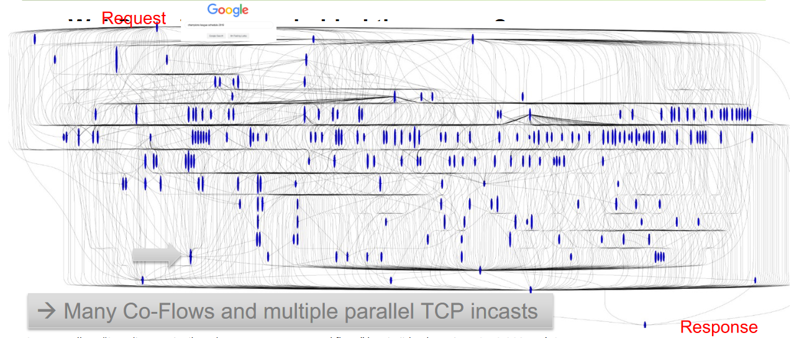
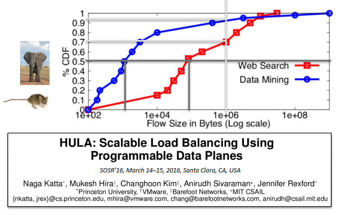
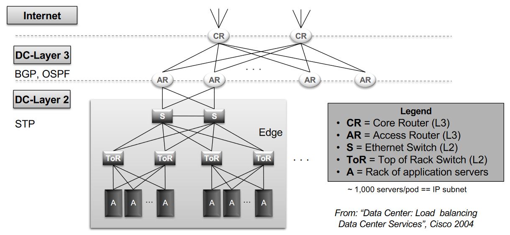
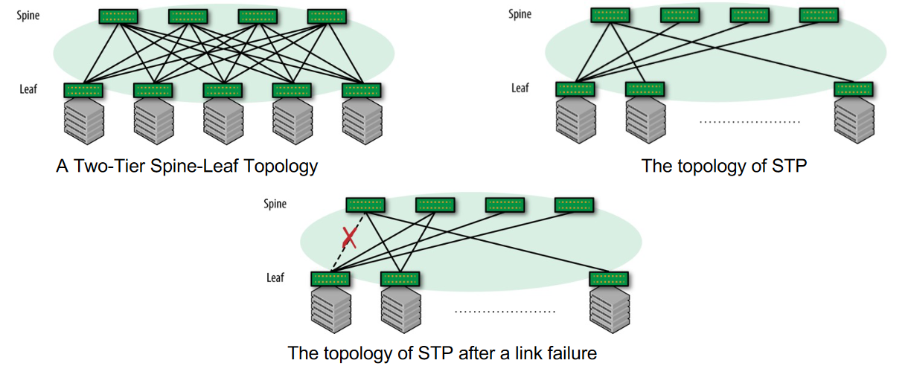
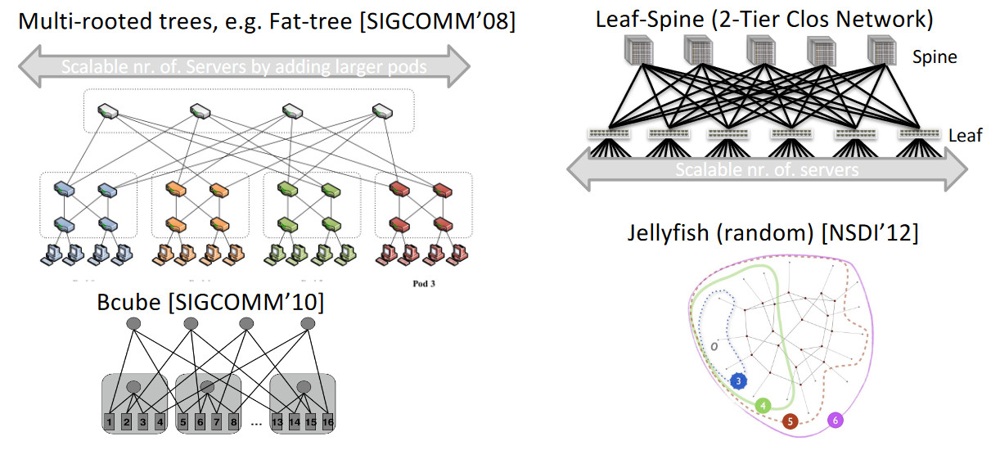

# Lecture 4 Data Centers

## Data Center Networks

## Websearch - Whats behind the scenes?

* What happens when we search the web?
  * Click on the page -> get google results
* How does a search engine find results so fast?
  * Need low latency
  * Web server takes the request
    More so 100s of servers that handle your request
    Look through the indexed sites
    Consolidate the results
    Spit them back at you
* Do we crawl the whole Web in real time?
* Can we store the whole web on a single server?
* How many machines do we need for that? 10? 10.000?

### Answer: We use Data centers to search the Web

* Warehouse computing of millions of commodity servers
* Have massive amount of CPU and disc
  * Some have more discs for space some have the cpu for the processing
* Carry massive amount of tracffic

## Web Applictation Architecture

Web Browser -> "internet" -> Web Server -> Backend -> Database

Request sent over the internet to the target server
Processed by the backend
It fetches something you requested
Then sends it back to you

Databases are running on **Multiple** servers to spread the load

## Latency Accumuation in a Data center

If the network is slow (10ms) to send each request it adds up quickly
each client adds an additional delay of 10ms

google survey -> if you have latency the customers will not use product

## The real journey of a websearch

40 parallel servers handling the request to find the results for the first page
First webserver handles your request
then fans out to the rest of the network to see who has pages fitting your search
asking servers who also asks their close servers for their results to send back

*Many Co-Flows and multiple parallel TCP incasts*
The server handling the summation of the requests to get the results have hundreds of tcp connections
*Eqres queue* for the incoming packets, too many packets they get dropped
If packets drop in TCP they send again! wohoo we get even more traffic on the network
Shortqueue -> drop -> TCP congestion control
Longqueue -> latency spike
Alot of different protocols specialized for the datacenters "DC TCP" as an example

#### TCP Flow:

A series of packet on the same connection with the same data of sender and destination
Ex. Same ip source, ip dest, source port, dest port and the TCP

#### Co-Flow:

A set of flow you need to finnish before you can make progress on the result
If you optimise the flows to finish fast you need all of them to finish fast
Ex. if one finishes fast and one does not you still need to wait for the slow client to finish before cont.

## In Data Center, Communication is crucial

* Application Performance for Data Center Apps crucial for the service to be accepted
* Facebook analytics jobs spend 33% of runtime in communication
* As *in-memory systems proliferate*, the network MUST scale for not become the bottleneck
* Application flow
  * A sequence of packets between two endpoints
  * Independed unit of allocation, sharing, load balancing, and prioritization
* Framworks Spark, Hadoop, Yam - doesnt seem relevant to course but might be fun

## Coflow and performance

skipped slide

## What is important to a data center?

* High availability
  * no downtime
  * down one minute is a serious disaster
    * bwm story
    * all computation connected to AWS
    * 100.000s transactions per minute
    * if amazon goes down bwm stops making cars and millions of € are lost
* High efficiency
  * You need to transfer data efficient
* Smart agility
  * we need to be clever and add more and more resources as the load increases
  * as more and more users join a stream we launch more and more servers that serve them
  * scale with the demands
* Security

## Datacenter main characterisic: elasticity

* Manage the workload!
* Manage the storage!
  * Memcache
  * HDFS (highly distributed filesystem)
* Manage the Network!
  * Allows a server to communicate with other servers, regardless of location
  * Vision: os->RDMA **CHECK SLIDEs**

### Datacenter Architecture

* Hierarchical
  * Rack
    * Top-of-Rack (TOR) architecture
  * Cluster
    * several racks form a clusters
  * DC
    * several clusters form a Datacenter(DC)
  * Multiple DC
    * Can also be connected
* Questions
  * How to connect the Racks?
  * How to connect the DCs?
    * google own the networks that connect their datacenters

## Datacenter traffic characteristics

paper examples:

* Inside the Social Networks's (Datacenter) Network
  * ACM SIGCOMM 2015
  * facebook
* Jupiter Rising: A decade of Clos Topoligies and Centralized Control in Google's Datacenter network
  * ACM SIGCOMM 2015
  * google

| Locality   | All  | Hadoop | FE   | Svc. | Cache | DB   |
| ------------ | ------ | -------- | ------ | ------ | ------- | ------ |
| Rack       | 12.9 | 13.3   | 2.7  | 12.1 | 0.2   | 0    |
| Cluster    | 57.5 | 80.9   | 81.3 | 56.3 | 13.0  | 30.7 |
| DC         | 11.9 | 3.3    | 7.3  | 15.7 | 40.7  | 34.5 |
| Inter-DC   | 17.7 | 2.5    | 8.6  | 15.9 | 16.1  | 34.8 |
|            |      |        |      |      |       |      |
| Percentage |      | 23.7   | 21.5 | 18.0 | 10.2  | 5.2  |

Percentage row shows how large of a precentage each traffic type have on the network
Out of all traffic in a DC 13% stays within the rack
57% of all traffic stays inside the cluster
More traffic betweent the DCs than inside the rack

if a request need 200 servers and a rack has 48 servers its clear you need to communicate between racks,clusters and even sometime DCs

intra DC communication can be such as fetching data that is infrequently used and is not cached on each DC

| Job Category    | B/w (%) |
| ----------------- | :-------- |
| Storage         | 49.3    |
| Search Serving  | 26.2    |
| Mail            | 7.4     |
| Ad Stats        | 3.8     |
| Rest of traffic | 13.3    |

Lost of storage data, can be because google drive
intuition says that we would like to stay inside the rack for less jumps
but google push the design to leave that rack, why?
the benefit is scalability, redundancy - if its spread out you can recover data

## Concurrent flows

* "Webservers and cache hosts have 100s to 1000s of concurrents connections"
* "Hadoop nodes have approximately 25 concurrent connecions on average"
* "median inter-arrival time of approx. 2ms"
  * time between each new connection
  * 500 reqs per second

## Datacenter traffic characteristics

* Different application flow types
  * large flows (Elephant)
    * Few, carry the most volume
      * Video streaming
      * backups
    * Lives for a long time
      * streaming video can be an hour or more
  * small flows (Mice)
    * Many, small volume in total
      * Email
      * Chat messages
      * Web requests
    * Lives for a short time
      * does not live for a long time
* Traffic patterns
  * Highly Volatile
    * Changing rapidly even during a day
  * Highly Unpredictable
    * Weak correlation

CDF (commulative distribution function)
y = % CDF
X = Flow size in bytes (Log scale)
You can bin the flows to see how many are between 1-1000 bytes etc.etc.

you can see what flows are elephant and mice with this CDF graph

Challange is to find the elephant flows so we can optimize them
You dont know if its one before it happens
ex mice flow send and exit fast

## Datacenter Networks

* Redundancy
  * ex two top of rack switch for redundancy
* Connects servers with each other and the ouside world
* Built to optimize cos adn perform.
* Tiered architecture
  * 3 layers;
    * edge
    * aggregation
    * core
  * cheap devices at edges and expensive at cores
  * device typically proprietary and close
* Oversubscription of links closer to the core
  * fewer links towards core reduce cost
  * Trade loss/delay for fewer devices and links
    * we trade the loss of having capacity for the worst case scenario like everyone connecting as once because it happens so rarely to be able to use less devices and save money

p4.org - programming switches? fun to check

## Conventional Datacenter Network

* CR = Core router (l3)
  * some CRs have internet connectivity but not all
    if they are on the edge they have a chance to be connected to the internet to talk to the ISP for ex
  * but some just serves the intra-DC traffic and have no need or ability to connect to the internet
* AR = Access Router (l3)
* S = Ethernet Switch (l2)
* ToR = Top of Rack Switch (l2)
* A = Rack of application servers

*Why cant i make this all layer 2 switching?*

* Main issue is the broadcast traffic
  if all is a switch domain the 100.000s of messages will be replicated
  and go down just because of the traffic from the broadcasts

when we construct this multi tiered network we need to conside the bandwith at all layers

## Problem with layer 2 Switching

**get pic from slides**

A two-tier Spine-Leaf Topology

The topology of STP

The topolog of STOP after a link failure

## BGP related issues: Path hunting

www.noction.com/blog/bgp-path-hunting

What is the timeout when a link goes down?
When do i tell the others
Recall how RIP works and other protocols
Send messages on how to repair the connectivity

## ASN Numbering

doenst apply to this course it seems

## BGP TImer settings

* Complex configuration impacts stability of routes
  * Advertisement interval
  * keepalive timer
  * hold timer
  * connect timer

## COnventional DC network problem

going fast wroom wroom

## Multirooted tree properties

* One switch network
  * Such a big switch that it deals with all the traffic in the network
  * impossible to build - too big - to complex
* all other topology we do we tried to get this one big switch abstraction
  * reduce all hops we take within the network to realize this one big swtich design

## Example topology design

* Fat-tree
  * tree with multiple roots
  * k number = number of roots
* Leaf-Spine (2-Tier Clos Network)
  * certain number of spine and leaf switches
  * but have a full mesh between the leafs and the spines
    this is not the case with the Fat-tree topology
* Bcube
* Jellyfish (random)

## Multirooted tree properties

paper tips
Multi-rooted tree [fat-tree, Leaf-spine, ...] achive full bisection bandwith assuming perfect multipathing

(k/2)^2 core switches each connects to k pods -> Supports (k^3)/4 hosts

## Google: Approximating Big Switch

* Google 2004: Cluster Routers (CR)
  * 512 ports -> expensive
  * Special purpose
  * Oversubscription -> bottleneck for intra-rack
* Challange
  * How can we increase capacity?
  * how can we apporximate one big switch with cheap commodity switches using clever load-balancing?

## Multirooted tree problems

With standard routing, can only exploit a single path

FLow collisions result in suboptimal traffic distribution

Packet based load-balancing results in reordering (TCP!)

For each IP packet you only get one path, BUT we have alot of paths available to use in our topology

Make a file tranfer -> open socket -> load from disc -> send on path until you finished with file

Facebook file transfer, check git

* 4 worker threads
* each thread read a portion of the file in parallel
* 4 ports to send it in parallell

we need a method to utilize all the paths we have available and the answer is ECMP

Flow collison is when two flows are on the same link they need to share capacity
Maybe we need to route over another link so we have full bandwith
The tradeoff with latency is not a problem because we save the time with having a clear path

## Implications for DC Networking

* MASSIVE internal network traffic
* complex network shared by many applications
* TIght deadlines for network I/O -> business impact
* Congestion and TCP incast due to many Co-Flows
* Low latencyy and high capacity at the same time
* Need highly adaptive localized capacity on demand -> fine loadbalancing
* Cheap, scalable, fault tolerance, ...
